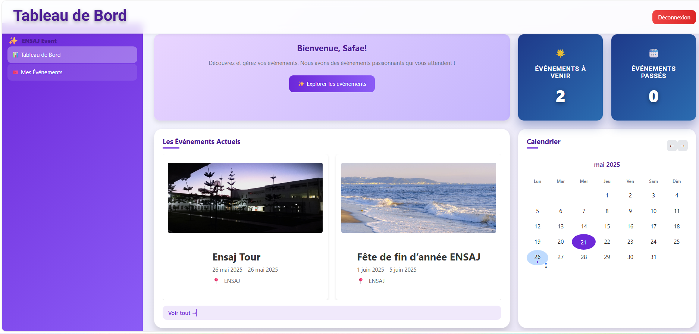
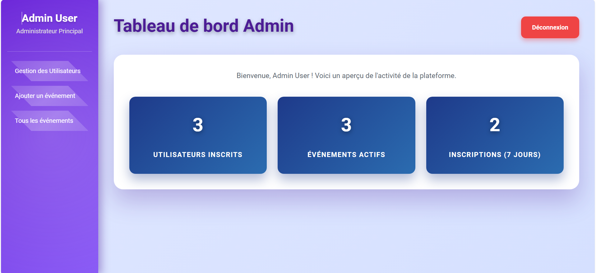

<p align="center">
  <a href="#"></a>
  <a href="#"></a>
  <a href="#"></a>
</p>

## About ENSAJ Events

**ENSAJ Events** est une plateforme web de gestion et de participation aux événements académiques organisés par l'École Nationale des Sciences Appliquées d'El Jadida. Elle permet aux étudiants de visualiser et de participer aux événements, aux administrateurs de créer des événements, et de gérer les listes des participants.

### Fonctionnalités principales

* Création et affichage d'événements (nom, description, date, image, lieu)
* Tableau de bord administrateur : liste des événements et des participants
* Tableau de bord participant : gestion de l'inscription aux événements
* Système d'authentification sécurisé (login, logout)

## Technologies utilisées

* **Frontend :**
- ReactJS
- React Router pour la navigation
- Axios pour les requêtes API
- Bootstrap ou Material UI pour les composants d'interface

* **Backend :**
- Laravel (API RESTful)
- Authentification JWT
- MySQL pour la base de données
- Eloquent ORM
  
* **Base de données :** MySQL

## Installation

# 🧱 Prérequis
- PHP ≥ 8.1
- Composer
- Node.js ≥ 16
- npm
- MySQL ou MariaDB

# Backend (Laravel)

```bash
cd ensaj-events-backend
composer install
cp .env.example .env
php artisan key:generate
php artisan migrate
php artisan serve
```

# Frontend (React)

```bash
cd ensaj-events-frontend
npm install
npm run dev
```
# 1. Cloner le projet
```bash
git clone https://github.com/N09-2024/ensaj-events.git
cd ensaj-events
```

# Installation des dépendances
```bash
composer install
```

# Configuration de l'environnement
```bash
cp .env.example .env
php artisan key:generate
```

# Configuration de la base de données dans le fichier .env
* **Modifier les valeurs selon votre configuration**
```bash
DB_CONNECTION=mysql
DB_HOST=127.0.0.1
DB_PORT=3306
DB_DATABASE=events
DB_USERNAME=root
DB_PASSWORD=
```

# Migration de la base de données
```bash
php artisan migrate
```

# (Optionnel) Remplir la base de données avec des données de test
```bash
php artisan db:seed
```

# Lancer le serveur
```bash
php artisan serve
cd ensaj-events/ensaj-events-frontend
```

# Installation des dépendances
```bash
npm install
```

# Configuration de l'URL de l'API dans le fichier .env
* **Créer un fichier .env s'il n'existe pas**
```bash
echo "REACT_APP_API_URL=http://localhost:8000/api" > .env
```

# Lancer l'application
```bash
npm start
```

## 💾 Structure de la Base de Données

La base de données comprend les tables principales suivantes :
- users - Informations sur les utilisateurs et administrateurs
- events - ensemble des événements disponibles

## 🔑 Accès à l'Application

### Accès Administrateur
- Email: admin@ensaj.com
- Mot de passe: password123

### Accès Utilisateur
- Email: participant@ensaj.com
- Mot de passe: password123


## 📞 Contact

Pour toute question ou assistance, veuillez contacter [erraji.nour12@gmail.com] ou [elouajidisafae@gmail.com] ou [nouhaelbahloul366@gmail.com]

## Screenshots

<p align="center">
  
</p>
<p align="center">
  
</p>
<p align="center">
  
</p>

## 👩‍💻 Équipe du projet

<p align="center">
  <b>Projet réalisé par les étudiantes de l’ENSAJ</b><br>
  <i>Dans le cadre du module Développement Web</i>
</p>

<ul>
  <li><b>Étudiante 1 :</b> Er-raji Nour - [@errajinour12] (https://github.com/errajinour12) </li>
  <li><b>Étudiante 2 :</b> El Ouajidi Safae - [@elouajidisafae] (https://github.com/elouajidisafae) </li>
  <li><b>Étudiante 3 :</b> El Bahloul Nouha - [@N09-2024] (https://github.com/N09-2024) </li>
</ul>

<p align="center">
  🎓 <b>École Nationale des Sciences Appliquées d'El Jadida</b><br>
  📅 <b>Année universitaire :</b> 2024-2025
</p>

## Contribuer

Les contributions sont les bienvenues ! Veuillez ouvrir une *issue* ou proposer une *pull request* pour toute suggestion ou amélioration.

## License

Ce projet est open-source sous licence [MIT](https://opensource.org/licenses/MIT).

---

> Projet réalisé dans le cadre d'un projet universitaire à l'[ENSAJ](https://ensaj.ucd.ac.ma) - Université Chouaib Doukkali.
